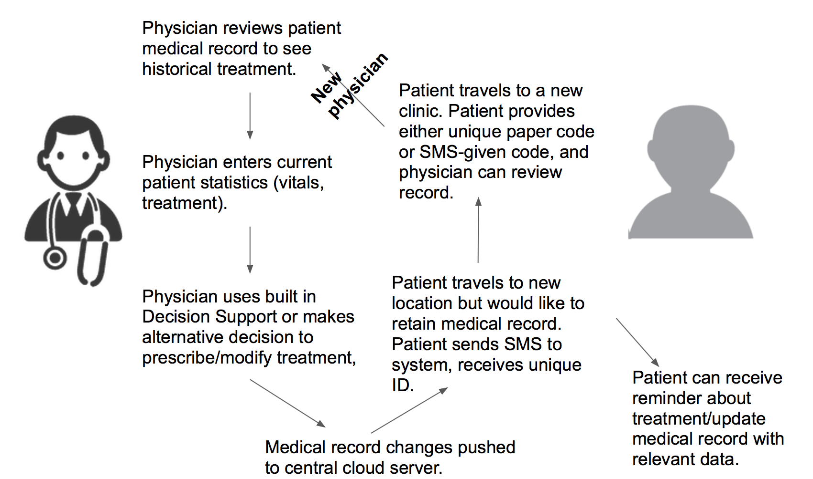
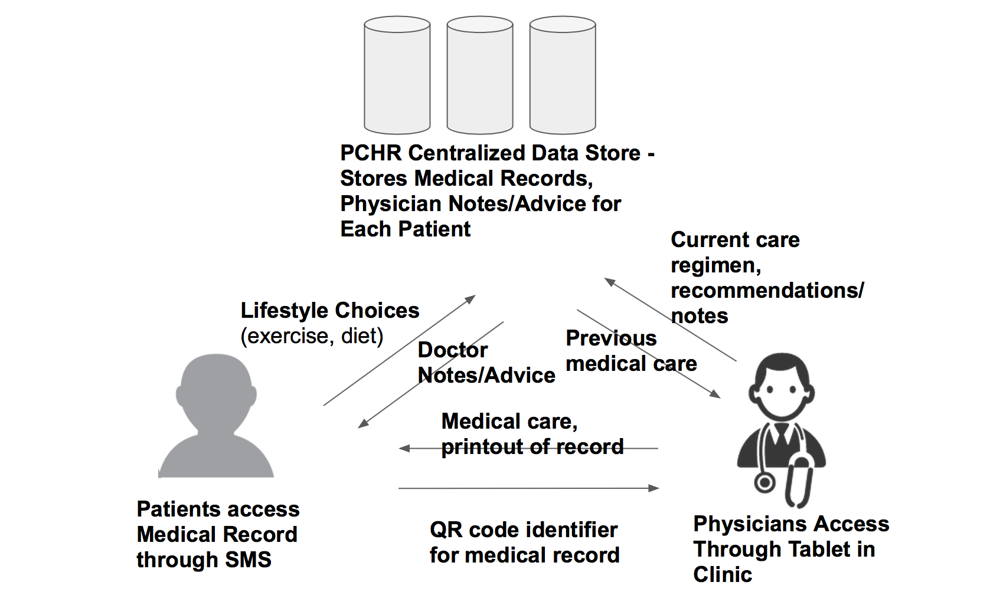

# Project Scope
The Spring 2017 PCHR project involves the refinement for the ongoing Sana PCHR Lebanon project to allow for wider disemination as well as real-time data analytics and actionable reporting for physicians, clinic/hospital administrators, sponsors and ministries of health.

## Sana PCHR Platform overview
The Sana patient-controlled health record (PCHR) platform is a mobile-health tool in the form of an electronic medical record with covering the needs of vulnerable populations. The overarching goal of Sana PCHR is to reduce the rates and severity of non-communicable diseases (NCDs) among refugee populations in resource-limited settings worldwide. The inception of this proyect and its initial target population focused on Syrian refugees; nonetheless, it is expected that its use eventually extends beyond this niche into other nation-wide healthcare systems. 

### Relevance of Non-communicable diseases
(http://www.who.int/mediacentre/factsheets/fs355/en/)

Noncommunicable diseases (NCDs), also known as chronic diseases, are not passed from person to person. They are of long duration and generally slow progression. The 4 main types of noncommunicable diseases are:
- Cardiovascular diseases (e.g. heart attacks and stroke)
- Cancers
- Chronic respiratory diseases, such as chronic obstructive pulmonary disease (COPD)and asthma 
- Diabetes.

Key facts on global burden of NCDs (WHO 2015, Fact sheet on Non-communicable diseases) are:
http://www.who.int/mediacentre/factsheets/fs355/en/

- Noncommunicable diseases (NCDs) kill 38 million people each year.
- Almost three quarters of NCD deaths - 28 million - occur in low- and middle-income countries.
- Sixteen million NCD deaths occur before the age of 70; 82% of these "premature" deaths occurred in low- and middle-income countries.
- Cardiovascular diseases account for most NCD deaths, or 17.5 million people annually, followed by cancers (8.2 million), respiratory diseases (4 million), and diabetes (1.5 million).
- These 4 groups of diseases account for 82% of all NCD deaths.
- Tobacco use, physical inactivity, the harmful use of alcohol and unhealthy diets all increase the risk of dying from an NCD.
- NCDs in general require *continuous* care to prevent further complications. For example, a diabetic foot ulcer if detected early is much easier to treat.
- Global cost associated with treating NCDs surpass the trillion dollar mark every year, due to NCDs lengthy treatment regimes

Key facts on burden of NCDs in Lebanon and Syria (http://www.who.int/nmh/countries/syr_en.pdf) are:
- NCDs are highly prevalent in the Syrian population and are responsible for [almost half](http://www.who.int/nmh/countries/syr_en.pdf) of deaths within the region
- Syrian refugees do not generally have continuous care for NCDs because they encounter different physicans who treat them without understanding their prior medical history.
- Continuous treatment of NCDs require substantial behavioral changes and strict medication adherence, something particularly difficult to achieve in refugee populations where patient follow-up is specially difficult.

### Sana PCHR history and current status (as of March 22nd 2017)
Starting in early 2015, Sana PCHR was envisoned as a mobile health tool for chronic disease management in refugee populations as a proyect developed by the Massachusetts Institute of Technology (MIT) in conjunction with the Johns Hopkins University (JHU). Working closely with the government of Lebanon, this system was intended to be designed specifically to meet the needs of Syrian refugees. The first iteration of Sana PCHR was deployed for testing on February 2017, pilot evaluation that is expected to continue until September of 2017. Data in the form of digital health records has already been obtained through this platform (from approx. 3,000 patients). Current data reporting capabilities for Sana PCHR are limited to retrieval of full database for analysis in external software such as SAS and R (no real-time analytics has been implemented). Easy to use reporting schemes are also unexistent in the current implementation of Sana PCHR. Preliminary evaluation of the clinical utility of this system is still "inconclusive" and further analysis is required to prove or reject its usefulnes in field use; nonetheless, data is suggestive of a positive effect in the use of this system for improving care in this refugee population.

### Sana PCHR strategy
To provide a secure, easy to use and actionable open-source medical record system for vulerable populations that allows physicians to acces the medical history of patients *as recorded by previously encountered physicans* to inform further care of patients (see Care Flow Diagram below from PCHR 2016). This system should allow for communication of actionable information across physicians accessing the medical record potentially at different timepoints and locations to provide evidence-based care, reduce adverse effects, reduce cost and improve outcomes of NCDs. It is also an strategic focus to enable real-time data analytics and reporting of agregated patient data through Sana's PCHR framework to facilitate population-based interventions and to provide better accountability for sponsors.

### Sana PCHR Framework
The PCHR system contains (see Data Flow below):
- SMS reminders sent to patients to assist with medication adherence and to remind patients about patient appointments.
- An Android Client for physicians to record information during an appointment.
- A Decision Support System to assist with the interpretation of certain clinical scores with respect to Non-communicable diseases.

Care Flow             |  Data Flow
:-------------------------:|:-------------------------:
  |  

### Sana PCHR Value proposition
The desired value proposition for this system is:
- Measurable reduction in the incidence and prevalence of NCDs through providing higher-quality and more continuous healthcare to refugee populations
- Measurable reduction of complications derived from NCDs
- Measurable reduction in costs for healthcare providing organizations (e.g. by providing a less expensive option for collection of patient data avoiding in-person paper surveying at the local clinics)
- Automation collection, analysis and reporting of population-level agregate data to guide interventions and research by partnering organizations or justify funding from sponsors.

See a video created in 2016 [Introductory Video](https://vimeo.com/90270531) for more details. 

## Spring 2017 Sana PCHR Project Requirements
### Absolute requirements 
- Improve dissemination of Sana PCHR platform
  1)	Evaluation of current website (Sana PCHR) usability strengths and issues
  2)	Development of a website roadmap based on user input
  
- Real-time data analytics to enable evidence-based actionable interventions
  1)	Review the existing data (what has been reported)
  2)	What should be collected? ()
  3)	Analysis, development and implementation of epidemiological models to analyse reportable data
  4)	Analysis, development and implementation of dasic deep learning framefok for data mining

- Integrated data reporting capabilities to improve accountability with sponsors and facilitate continuing funding
  1)	How could the data be presented for the different stakeholders (from analysis of what information is most valuable for them, and also considering information slicing by provider, patient type, billing, operational pieces, etc as desired by relevant stakeholders)

### Desired requirements 
- Securement of additional grants to continue improvements and implementation
- UX redesign to further ease use of platform

## Relevant stakeholders
- Current Sana PCHR sponsors
- Current Sana PCHR collaborators (e.g. UNHCR)
- Local clinics administrators (e.g. clinics using Sana PCHR)
- Local clinical personnel (e.g. nurses, physicians, voluntaries, technicians)
- Ministries of Health (e.g. Lebanon Gov)
- Potential future Sana PCHR sponsors
- Potential future Sana PCHR collaborators (e.g. UNHCR)

## Limitations
- Involved developers: 3 students 12 credits + 1 student 4 credits
- Development time < 2 months

## Process
- Scrum will be used as an iterative and incremental agile software development framework for managing product development of Spring 2017 Sana PCHR objectives.

### SCRUM Roles 

- Product Owner (Kenneth Paik)
- Scrum Master (TBD).- accountable for removing impediments to the ability of the team to deliver the product goals and deliverables. The Scrum Master is not a traditional team lead or project manager, but acts as a buffer between the team and any distracting influences. The Scrum Master ensures that the Scrum framework is followed. The Scrum Master helps to ensure the team follows the agreed processes in the Scrum framework, often facilitates key sessions, and encourages the team to improve. The role has also been referred to as a team facilitator[20] or servant-leader to reinforce these dual perspectives.
- Development Team (TBD)

## Timeline
- Final Class deliverable: May 12

## Deliverables
- At least Absolute requirements by May 12, 2017

### Project Outputs

### Semester Progress

## Student Team Members
Luis R Soenksen (Ph.D. Candidate | Mech. Eng. | Massachusetts Institute of Technology)

Neha Safaya

Krysla Grothe

Maimuna (Maia) Majumder

The students are advised by Dr. Kenneth Paik
